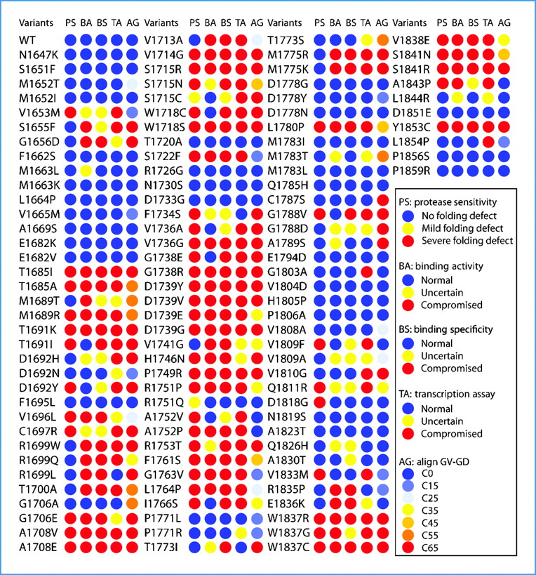

```{r, include = FALSE}
knitr::opts_chunk$set(
  collapse = TRUE,
  comment = "#>"
)

library(agvgd)
```

## Introduction

One of the greatest challenges in the study of cancer risk is the assessment
of unclassified missense variants.

Besides using biochemical and cell-based transcriptional assays to assess the
structural and functional defects associated with missense variants, one can
also use bioinformatics analysis based on multiple sequence alignment data and
protein structure prediction to approach this problem.

Align-GVGD is one such method that uses protein multiple sequence alignment
(PMSA) data to provide cancer risk estimates.

In this vignette we show you how you can use `{agvgd}` to reproduce the results
obtained by Lee *et al.* (2010) @Lee.CR.2010 on the study of missense variations in the BRCT
Domain of BRCA1 gene.

In Lee's paper, Align-GVGD prediction scores are part of their
cross-validation of structural and functional assays, as indicated in the column
labeled AG in [Figure
3](https://www.ncbi.nlm.nih.gov/pmc/articles/PMC3040717/figure/F3/) of said
paper.

```{r  out.width = "90%", echo=FALSE}
 
```

## Reproducing the AGVGD scores

### Data sets

To reproduce the AGVGD prediction scores, we need two data
sets:

- The protein sequence alignment of BRCA1 that included the BRCT Domain
- The list of the 117 BRCA1 missense variants studied @Lee.CR.2010

Both these data sets are already bundled with `{agvgd}`.

To read in the alignment of BRCA1 use the function `read_alignment()` and the
name of the gene `"BRCA1"`:

```{r}
brca1_alignment <- read_alignment("BRCA1")
print(brca1_alignment, width = 100)
```

To read in the 117 BRCA1 missense variants, i.e., the 117 substitutions, we
use the function `read_substitutions()`:

```{r}
path <- system.file("extdata/lee2010_sub.txt", package = 'agvgd', mustWork = TRUE)
missense_variants <- read_substitutions(path)
missense_variants
```

The list of missense variants comes with the indication of the residue number in
the protein sequence, i.e. column `res` in `missense_variants`. As we'll see
next, the function `agvgd()` uses the alignment positions (column `poi` in
`missense_variants`) instead to refer to those positions in the alignment.

The difference between `res` and `poi` is that `res` counts the residues in the
protein primary sequence reference, while `poi` refers to the positions in the
alignment, accounting for gaps.

So, before we proceed, we will update the `missense_variants` tibble and replace
the `NA` values with the corresponding `poi` values. For that we use the
function `res_to_poi()`:

```{r}
missense_variants$poi <- res_to_poi(brca1_alignment, missense_variants$res)
missense_variants
```

### Running `agvgd()`

Run Align-GVGD with the function `agvgd()`:

```{r}
scores <- agvgd(alignment = brca1_alignment,
      poi = missense_variants$poi,
      sub = missense_variants$sub)

print(scores, n = Inf)
```

## References
