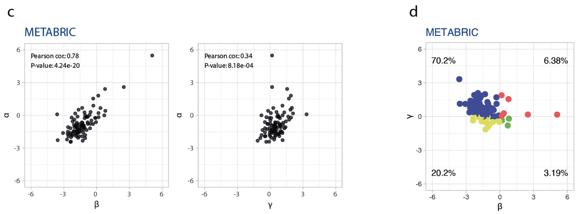

```{r, include = FALSE}
knitr::opts_chunk$set(
  collapse = TRUE,
  comment = "#>"
)

library(agvgd)
```

## Introduction

PIK3CA is a frequently mutated oncogene in human cancers, with mutations
found in various cancer types, including endometrial, ovarian,
colorectal, breast, cervical, squamous cell cancer of the head and neck,
chondroma, and thyroid carcinoma [@german_2013]. The PIK3CA gene encodes the p110α
catalytic subunit of phosphatidylinositol 3-kinase [@ligresti_2009].

Somatic missense mutations in PIK3CA have been reported in many human
cancer types, and are predominantly found in the kinase and helical
domains of the PIK3CA subunit [@karakas_2006].

According to karakas_2006 at al, some of the most common PIK3CA mutations associated with cancer
include:

  1. Exon 9 (G1624A:E542K)
  2. Exon 20 (A3140G:H1047R) 
  3. Exon 1 (E545K)

PIK3CA mutations are more common in tumors with mutant PTEN genes than
in tumors with wild-type PTEN genes [@samuels_2010]. The discovery of oncogenic
mutations in PIK3CA has emphasized the important role of PI3K in cancer
pathogenesis and made it possible to quickly and easily identify tumors
with activation of PI3K signaling by virtue of mutations in PIK3CA [@samuels_2010].

In this vignette we use `{agvgd}` to classify the pathogenecity of the
missence mutations/variations reported in Correia and Magno et al
(2022) [@correia_magno_2022]. Here they report several mutations found in breast cancer, from which we selected the 
17 variants found in the metabric dataset. These will be used to showcase how the usage of the `{agvgd}` package can complement the findings from other biomedical data analyses.

```{r  out.width = "90%", echo=FALSE}
 
```

## Running agvgd

### Data sets

To use the `{agvgd}` package to predict the protein impact of the metabric variants reported in Correia and Magno et al [@correia_magno_2022], we need two data sets:

-   The list of the 17 metabric PIK3CA missense variants;
-   The protein sequence alignment of PIK3CA. 

These first dataset is readily available with the `{agvgd}` package, and the protein alignment is provide within the companion package `{protean}`. More information regarding the `{protean}` package can be found in its [GitHub repository](https://github.com/maialab/protean).

<br>

#### 1. Get the alignment dataset from `{protean}`

To retrieve the alignment of PIK3CA from the `{protean}` package, we will use the functions `read_profile()` and `profile_path()` using the gene name `"PIK3CA"`:

```{r warning=FALSE, message=FALSE}
# Load the required packages
library(agvgd)
library(protean)
library(tidyverse)

# Using protean

  # Check all oncoKB proteins that have alignment files in the protean package
  head(protean::oncokb_genes)

  # Confirm that PIK3CA is present
  grep("PIK3CA", protean::oncokb_genes, value = TRUE)

  # Get the alignment profile information for PIK3CA
  pik3ca_profile <- protean::read_profile(protean::profile_path("PIK3CA"))
  head(pik3ca_profile)

```

<br>

#### 2. Format the sequence profile to an alignment with `{agvgd}`

Next, the sequence profile must be converted to an alignment format. For this we must use the `profile_to_alignment()` function from the `{agvgd}` package. 

```{r}

# Using agvgd 

# Convert the protean sequence profile to an alignment
pik3ca_alignment <- agvgd::profile_to_alignment(pik3ca_profile)

# Check the first lines and columns of the alignment
pik3ca_alignment[1:15, 1:30]

```

<br>

#### 3. Read the file with substitutions of interest

The substitutions file should have one substitution per line, and the substitutions should be formatted in the following way:

**H1047Y** where H (Histidine) is the original aminoacid, 1047 is the protein position for this aminoacid, and Y (Tyrosine) is the new aminoacid originated by the missence mutation.   

To read in the 17 PIK3CA missense variants, we use the function `read_substitutions()` from the `{agvgd}` package:

```{r subs}
# Read the variants file
path <- system.file("extdata/correia_magno2022.txt", package = 'agvgd', mustWork = TRUE)

missense_variants <- agvgd::read_substitutions(path)
missense_variants
```

The list of missense variants comes with the indication of the residue number in the protein sequence, i.e. column `res` in `missense_variants`. As we'll see next, the function `agvgd()` uses the alignment positions (column `poi` in `missense_variants`) instead to refer to those positions in the alignment.

The difference between `res` and `poi` (position of interest) is that `res` counts the residues in the protein primary sequence reference, while `poi` refers to the positions in the alignment, accounting for gaps.

So, before we proceed, we will update the `missense_variants` tibble and
replace the `NA` values with the corresponding `poi` values. For that we
use the function `res_to_poi()` from `{agvgd}`:

```{r}
missense_variants$poi <- agvgd::res_to_poi(pik3ca_alignment, missense_variants$res)
head(missense_variants)
```

<br>

#### 4. Calculate the scores with *agvgd*

Run Align-GVGD algorithm with the function `agvgd()`:

```{r agvgd}
scores <- agvgd::agvgd(alignment = pik3ca_alignment,
      poi = missense_variants$poi,
      sub = missense_variants$sub)

print(scores, n = Inf)
```

<br>

##### Critical analysis

These results show that using all the sequences present in the ENSEMBL orthologous database will not provide insightful information for agvgd, since this method is very sensitive to the alignment. Here, it has classified all the variants with a score of C0, meaning that none of the changes of interest are clinically relevant.\
This is because using sequences that are so distantly related in the tree of life it is no longer reasonable to assume that those distant orthologous proteins share the same functions as the human protein of interest. Accordingly, the alignment must be curated to include a reasonable amount of sequence variation, but keeping only a subset of the proteins that are still evolutionarily close enough, so that they still share the same function, and therefore the same sequence constraints. 

<br>

#### 5. Curate the alignment and rerun the score calculation

A first round of curation can be done automatically by removing sequences so distant that they are over 90% different from the protein of interest (bidirectionally, i.e., between human and the orthologous, and between the orthologous and the human).

```{r eval=TRUE}

# Remove distant orthologs and redundant seqs
pik3ca_profile %>%
  filter(human_ortho_perc_id >= 90 & ortho_human_perc_id >= 90) -> vv_profile

# Format the profile to an alignment
vv_alignment <- agvgd::profile_to_alignment(vv_profile)

# Calculate the scores for the filtered alignment
vv_scores <- agvgd::agvgd(alignment = vv_alignment,
      poi = missense_variants$poi,
      sub = missense_variants$sub)

print(vv_scores, n = Inf)

```

<br>

##### Critical analysis after alignment filtering

After removal of distantly related proteins, the results show enough variability to allow the classification of variants that are know to be clinically relevant (for example, E545K with C65 score), showing the relevance of this step for the accuracy of the algorithm.


Additional rounds of curation can be done manually, by visually inspecting the alignment (for example using [Jalview](https://www.jalview.org/)), and re-running the `agvgd()` score calculation function using the manually curated alignments as input.

<br>

### References


